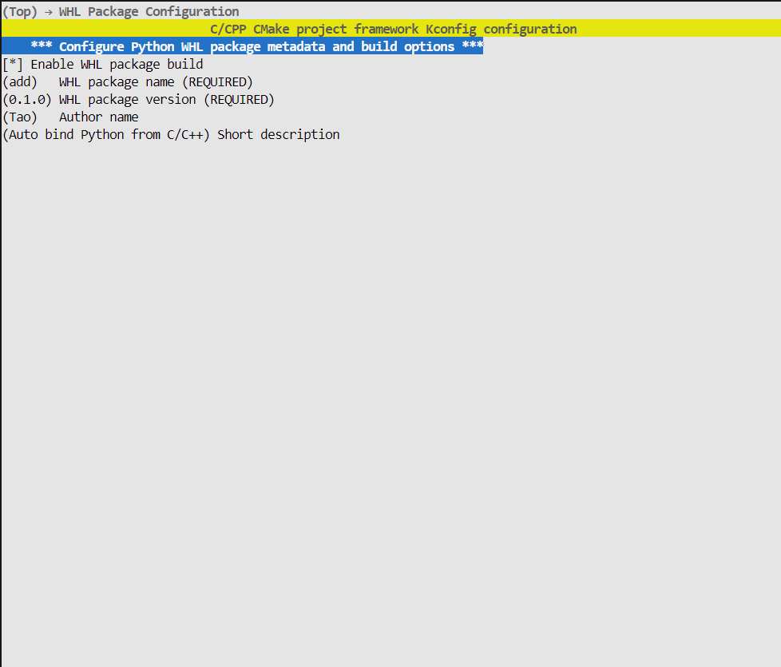
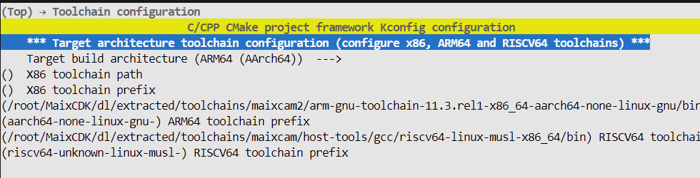

Auto bind Python from CC++
===================

> 一个足够简单易用并且可配置的用于从C/C++代码自动绑定为Python代码并生成whl包的工程

> 本项目克隆于:
https://github.com/Neutree/c_cpp_project_framework
并且编译代码部分与原仓库保持一致

> pybind11自动绑定部分参考代码:
https://github.com/sipeed/MaixPy/tree/main/components/maix


## 快速上手

* 1.克隆本仓库,进入/examples/demo目录
使用python project.py menuconfig进入图形界面配置编译工具链以及是打包whl文件

> 其中x86对应为本机编译,arm64对应为MaixCam2编译,RISCV64对应为MaiCam/Pro编译

* 2.写一个C/C++函数,以及hpp头文件,需要以whl包为文件名,方便自动识别:
```C++
namespace add::test
{
    int add(int a, int b) 
    {
        return a + b;
    }
}
```
为对应的函数写上@modul注释,后面跟上函数路径:
```C++
namespace add::test
{
    /**
     * My function, add two integer.
     * @param a arg a, int type
     * @param b arg b, int type
     * @return int type, will a + b
     * @module add.test.add
     */
    int add(int a, int b);
}
```
其中第一行为函数介绍,@param为参数介绍,@return为返回值介绍(可空)
如果只需要编译并打包为whl文件则无需修改main.cpp
使用python project build即可开始编译并打包whl文件
编译后安装whl后即可在直接直接调用:
```Python
import add
add.test.add(1,1)
```
